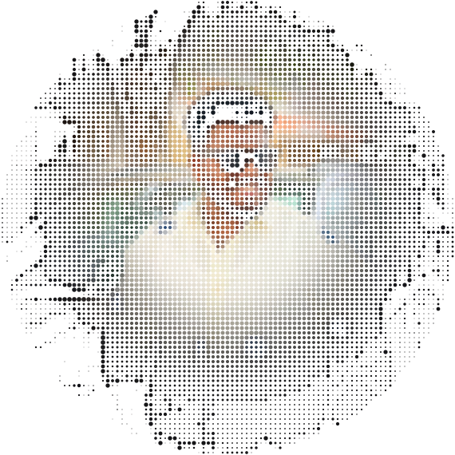
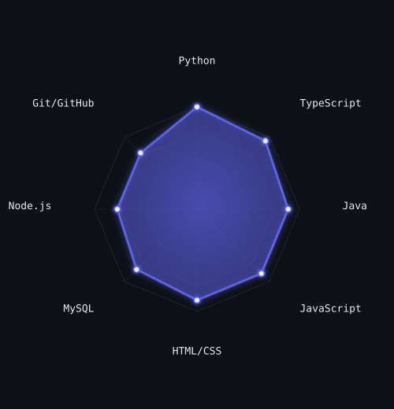
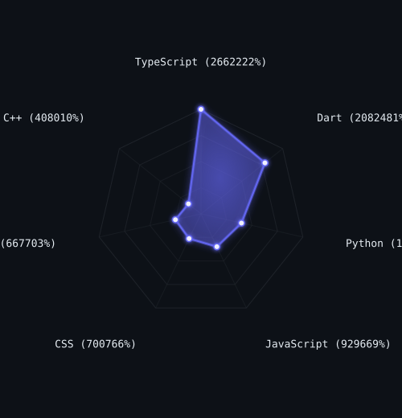
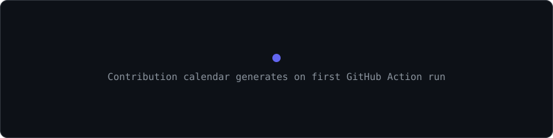
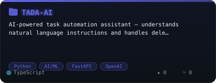
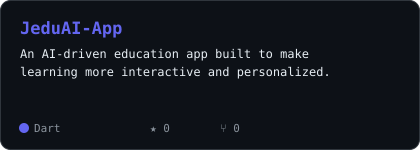
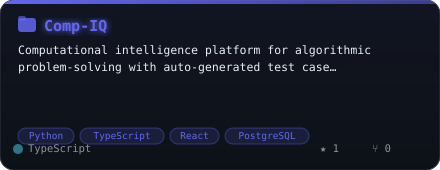
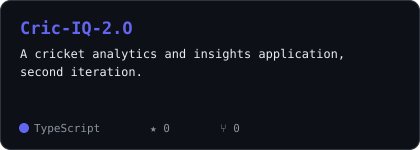

<div align="center">

<!-- HEADER BANNER -->


<!-- Portrait -->
<picture>
  <source media="(prefers-color-scheme: dark)" srcset="assets/portrait.svg">
  <source media="(prefers-color-scheme: light)" srcset="assets/portrait.svg">
  
</picture>

<!-- Typing animation -->


<br/>

<!-- Social badges -->
<a href="https://www.linkedin.com/in/mdshafiq45/">
  
</a>&nbsp;
<a href="mailto:shafiqhomelife@gmail.com">
  
</a>&nbsp;
<a href="https://md-shafiq.netlify.app">
  
</a>&nbsp;
<a href="https://github.com/Shafiq-456">
  
</a>

<br/><br/>


</div>

---

## `~/` whoami

```console
$ cat about.txt
```

> Fullstack developer and AI engineer in the making — turning ideas into production-ready apps.
> Currently completing my **B.Tech in Computer Science and Business Systems**.

<table>
<tr>
<td width="50%">

**🚀 What I'm up to**

- 🔭 Building **AI-driven apps** — TADA-AI, JeduAI, Comp-IQ, Cric-IQ
- 🌐 Portfolio: **[md-shafiq.netlify.app](https://md-shafiq.netlify.app)**
- 📖 Deep-diving into **applied ML engineering**
- ⚡ TypeScript-first on the frontend, Python-first on the AI layer

</td>
<td width="50%">

**🛠 Current Focus**

```python
stack = {
    "frontend"  : ["React", "Next.js", "Three.js"],
    "backend"   : ["Node.js", "FastAPI"],
    "ai_layer"  : ["Python", "OpenAI", "LangChain"],
    "mobile"    : ["Flutter", "Dart"],
    "databases" : ["MySQL", "Firebase", "MongoDB"],
}
```

</td>
</tr>
</table>

---

## `~/` tech stack

<div align="center">

**Languages**


**Frontend & Frameworks**


**Backend, AI & Tools**


</div>

---

## `~/` skill radars

<table><tr>
<td width="50%" align="center">

**Skill Radar** *(self-rated)*
<picture>
  <source media="(prefers-color-scheme: dark)" srcset="assets/radar-dark.svg">
  <source media="(prefers-color-scheme: light)" srcset="assets/radar-light.svg">
  
</picture>

</td>
<td width="50%" align="center">

**Language Radar** *(from real repo bytes)*
<picture>
  <source media="(prefers-color-scheme: dark)" srcset="assets/radar-langs-dark.svg">
  <source media="(prefers-color-scheme: light)" srcset="assets/radar-langs-light.svg">
  
</picture>

</td>
</tr></table>

---

## `~/` stats

<div align="center">

<a href="https://github.com/Shafiq-456">
  <picture>
    <source media="(prefers-color-scheme: dark)" srcset="https://github-readme-stats.vercel.app/api?username=Shafiq-456&show_icons=true&theme=tokyonight&hide_border=true&include_all_commits=true&count_private=true&bg_color=0d1117&title_color=6366F1&icon_color=818CF8&text_color=e6edf3&rank_icon=github">
    <source media="(prefers-color-scheme: light)" srcset="https://github-readme-stats.vercel.app/api?username=Shafiq-456&show_icons=true&theme=default&hide_border=true&include_all_commits=true&count_private=true&title_color=6366F1&icon_color=818CF8">
    
  </picture>
</a>&nbsp;&nbsp;
<a href="https://github.com/Shafiq-456">
  <picture>
    <source media="(prefers-color-scheme: dark)" srcset="https://github-readme-streak-stats.herokuapp.com?user=Shafiq-456&theme=tokyonight&hide_border=true&background=0d1117&ring=6366F1&fire=818CF8&currStreakLabel=A5B4FC&sideLabels=8b949e&dates=8b949e">
    <source media="(prefers-color-scheme: light)" srcset="https://github-readme-streak-stats.herokuapp.com?user=Shafiq-456&theme=default&hide_border=true&ring=6366F1&fire=818CF8">
    
  </picture>
</a>

<br/>

<a href="https://github.com/Shafiq-456">
  <picture>
    <source media="(prefers-color-scheme: dark)" srcset="https://github-readme-stats.vercel.app/api/top-langs/?username=Shafiq-456&layout=compact&theme=tokyonight&hide_border=true&bg_color=0d1117&title_color=6366F1&text_color=e6edf3&langs_count=8&hide=css,html,scss">
    <source media="(prefers-color-scheme: light)" srcset="https://github-readme-stats.vercel.app/api/top-langs/?username=Shafiq-456&layout=compact&theme=default&hide_border=true&title_color=6366F1&langs_count=8&hide=css,html,scss">
    
  </picture>
</a>

</div>

---

## `~/` activity

<div align="center">

<picture>
  <source media="(prefers-color-scheme: dark)" srcset="assets/metrics.dark.svg">
  <source media="(prefers-color-scheme: light)" srcset="assets/metrics.light.svg">
  
</picture>

<picture>
  <source media="(prefers-color-scheme: dark)" srcset="https://raw.githubusercontent.com/Shafiq-456/Shafiq-456/output/snake-dark.svg">
  <source media="(prefers-color-scheme: light)" srcset="https://raw.githubusercontent.com/Shafiq-456/Shafiq-456/output/snake-light.svg">
  
</picture>

</div>

---

## `~/` projects

<table>
<tr>
<td width="50%">
<a href="https://github.com/Shafiq-456/TADA-AI">
<picture>
  <source media="(prefers-color-scheme: dark)" srcset="assets/card-tada-ai-dark.svg">
  <source media="(prefers-color-scheme: light)" srcset="assets/card-tada-ai-light.svg">
  
</picture>
</a>
</td>
<td width="50%">
<a href="https://github.com/Shafiq-456/JeduAI-App">
<picture>
  <source media="(prefers-color-scheme: dark)" srcset="assets/card-jeduai-app-dark.svg">
  <source media="(prefers-color-scheme: light)" srcset="assets/card-jeduai-app-light.svg">
  
</picture>
</a>
</td>
</tr>
<tr>
<td width="50%">
<a href="https://github.com/Shafiq-456/Comp-IQ">
<picture>
  <source media="(prefers-color-scheme: dark)" srcset="assets/card-comp-iq-dark.svg">
  <source media="(prefers-color-scheme: light)" srcset="assets/card-comp-iq-light.svg">
  
</picture>
</a>
</td>
<td width="50%">
<a href="https://github.com/Shafiq-456/Cric-IQ-2.O">
<picture>
  <source media="(prefers-color-scheme: dark)" srcset="assets/card-cric-iq-2.o-dark.svg">
  <source media="(prefers-color-scheme: light)" srcset="assets/card-cric-iq-2.o-light.svg">
  
</picture>
</a>
</td>
</tr>
</table>

<sub>

| Project | Stack | Live |
|---|---|---|
| **TADA-AI** | Python · AI/ML · FastAPI · OpenAI | [→ repo](https://github.com/Shafiq-456/TADA-AI) |
| **JeduAI-App** | React · Node.js · AI/ML · MongoDB | [→ repo](https://github.com/Shafiq-456/JeduAI-App) |
| **Comp-IQ** | Python · TypeScript · React · PostgreSQL | [→ repo](https://github.com/Shafiq-456/Comp-IQ) |
| **Cric-IQ 2.O** | Python · Dart · Flutter · Firebase | [→ repo](https://github.com/Shafiq-456/Cric-IQ-2.O) |

</sub>

---

<div align="center">


<sub>
<code>01001101 01101111 01101000 01100001 01101101 01101101 01100101 01100100</code>
&nbsp;·&nbsp;
<a href="https://md-shafiq.netlify.app">md-shafiq.netlify.app</a>
</sub>

</div>
