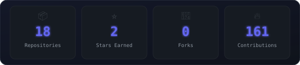

<div align="center">

<picture>
  <source media="(prefers-color-scheme: dark)" srcset="assets/portrait.svg">
  <source media="(prefers-color-scheme: light)" srcset="assets/portrait.svg">
  
</picture>


<a href="https://www.linkedin.com/in/mdshafiq45/"></a>
<a href="mailto:shafiqhomelife@gmail.com"></a>
<a href="https://md-shafiq.netlify.app"></a>
<a href="https://github.com/Shafiq-456"></a>


</div>

## `~/` whoami

```console
$ cat about.txt
```

Hi, I'm **Mohammed Shafiq**. Fullstack developer and aspiring AI engineer, currently completing my B.Tech in Computer Science and Business Systems.

- Currently building **AI-driven apps and tools** — see the project cards below
- Portfolio: **[md-shafiq.netlify.app](https://md-shafiq.netlify.app)**
- Learning **applied AI / ML engineering alongside the fullstack stack**
- Fun fact: **turns side projects into "AI" everything — TADA-AI, JeduAI, Comp-IQ, Cric-IQ**

<div align="center">

</div>

<table><tr>
<td width="50%" align="center">

**Skill Radar** *(self-rated)*
<picture>
  <source media="(prefers-color-scheme: dark)" srcset="assets/radar-dark.svg">
  <source media="(prefers-color-scheme: light)" srcset="assets/radar-light.svg">
  
</picture>

</td>
<td width="50%" align="center">

**Language Radar** *(from real repo bytes)*
<picture>
  <source media="(prefers-color-scheme: dark)" srcset="assets/radar-langs-dark.svg">
  <source media="(prefers-color-scheme: light)" srcset="assets/radar-langs-light.svg">
  
</picture>

</td>
</tr></table>

## `~/` activity

<div align="center">
<picture>
  <source media="(prefers-color-scheme: dark)" srcset="assets/metrics.dark.svg">
  <source media="(prefers-color-scheme: light)" srcset="assets/metrics.light.svg">
  
</picture>

<picture>
  <source media="(prefers-color-scheme: dark)" srcset="https://raw.githubusercontent.com/Shafiq-456/Shafiq-456/output/snake-dark.svg">
  <source media="(prefers-color-scheme: light)" srcset="https://raw.githubusercontent.com/Shafiq-456/Shafiq-456/output/snake-light.svg">
  
</picture>
</div>

## `~/` stats

<div align="center">
<picture>
  <source media="(prefers-color-scheme: dark)" srcset="assets/stat-card-dark.svg">
  <source media="(prefers-color-scheme: light)" srcset="assets/stat-card-light.svg">
  
</picture>
</div>

## `~/` projects

<table>
<tr>
<td width="50%">
<a href="https://github.com/Shafiq-456/TADA-AI">
<picture>
  <source media="(prefers-color-scheme: dark)" srcset="assets/card-tada-ai-dark.svg">
  <source media="(prefers-color-scheme: light)" srcset="assets/card-tada-ai-light.svg">
  
</picture>
</a>
</td>
<td width="50%">
<a href="https://github.com/Shafiq-456/JeduAI-App">
<picture>
  <source media="(prefers-color-scheme: dark)" srcset="assets/card-jeduai-app-dark.svg">
  <source media="(prefers-color-scheme: light)" srcset="assets/card-jeduai-app-light.svg">
  
</picture>
</a>
</td>
</tr>
<tr>
<td width="50%">
<a href="https://github.com/Shafiq-456/Comp-IQ">
<picture>
  <source media="(prefers-color-scheme: dark)" srcset="assets/card-comp-iq-dark.svg">
  <source media="(prefers-color-scheme: light)" srcset="assets/card-comp-iq-light.svg">
  
</picture>
</a>
</td>
<td width="50%">
<a href="https://github.com/Shafiq-456/Cric-IQ-2.O">
<picture>
  <source media="(prefers-color-scheme: dark)" srcset="assets/card-cric-iq-2.o-dark.svg">
  <source media="(prefers-color-scheme: light)" srcset="assets/card-cric-iq-2.o-light.svg">
  
</picture>
</a>
</td>
</tr>
</table>

<sub>

| Project | Stack | Link |
|---|---|---|
| TADA-AI | Python / AI | [repo](https://github.com/Shafiq-456/TADA-AI) |
| JeduAI-App | AI / Education | [repo](https://github.com/Shafiq-456/JeduAI-App) |
| Comp-IQ | Python | [repo](https://github.com/Shafiq-456/Comp-IQ) |
| Cric-IQ-2.O | Python / Analytics | [repo](https://github.com/Shafiq-456/Cric-IQ-2.O) |

</sub>

<div align="center">

01001101 01101111 01101000 01100001 01101101 01101101 01100101 01100100

</div>
